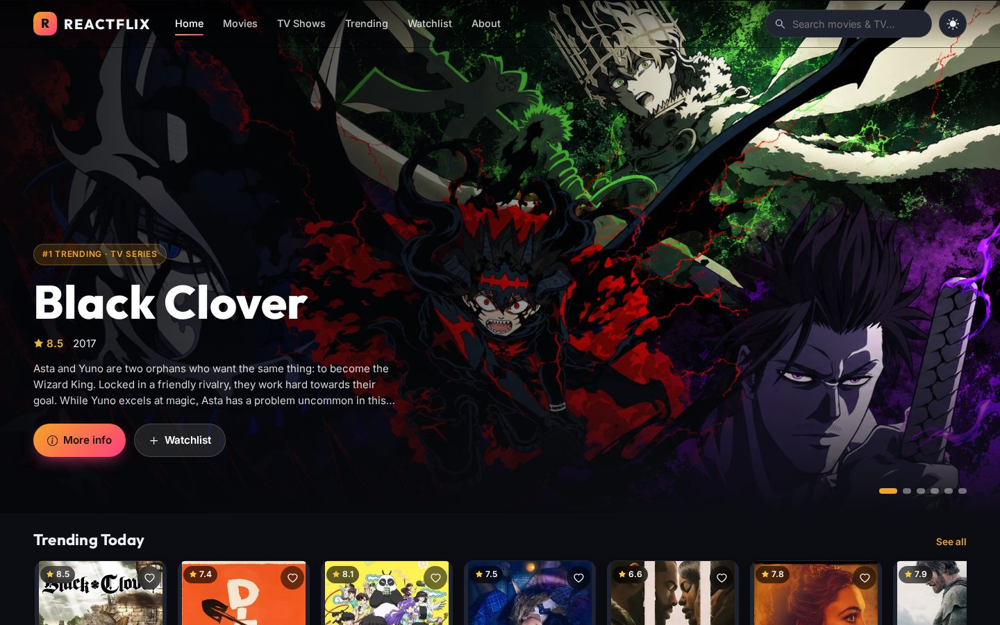
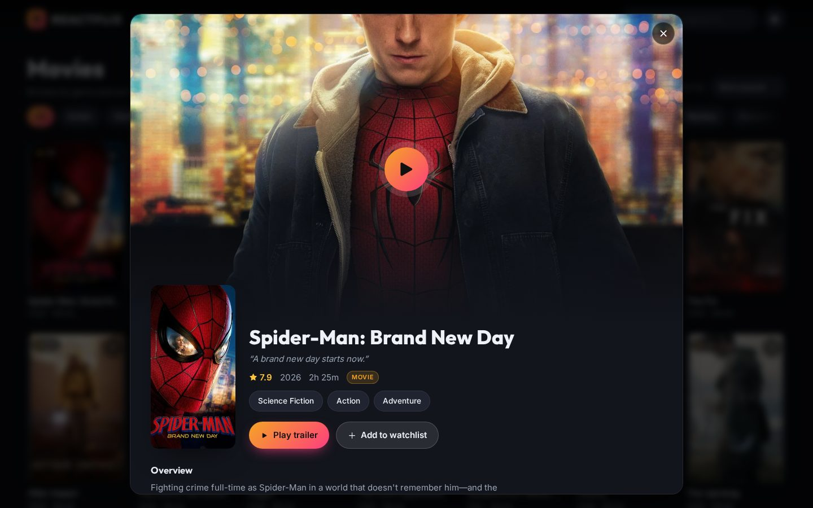
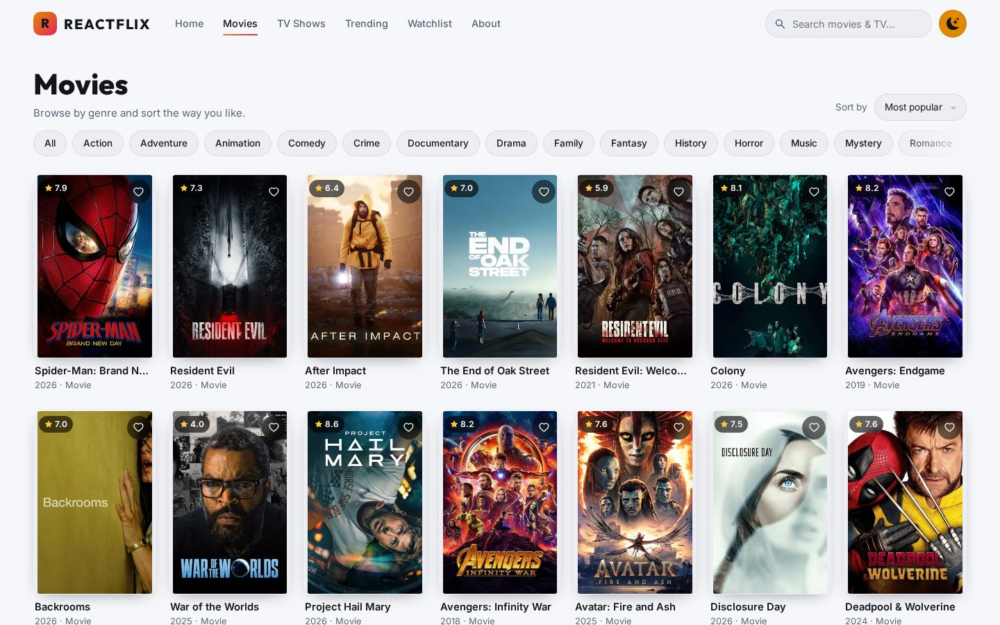
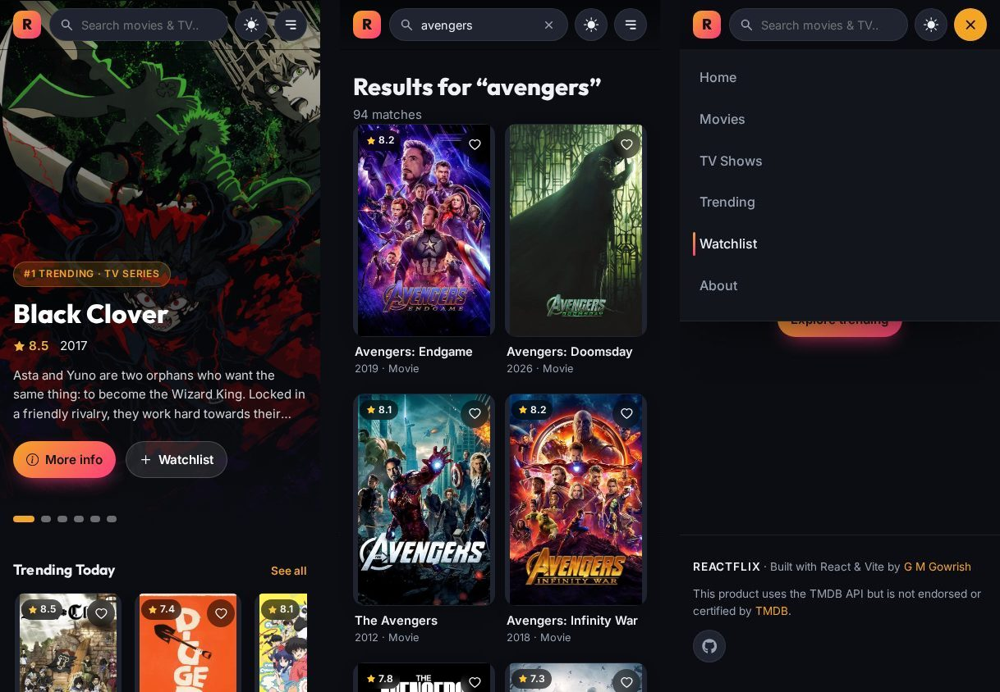

<div align="center">


# ReactFlix

**A modern, responsive movie & TV discovery app built with React, Vite and the TMDB API.**

Browse what's trending, dig into details, watch trailers and keep a personal watchlist — on any screen.

[](https://gmgowrish.github.io/react-movie-web.github.io/)

[](https://github.com/gmgowrish/react-movie-web.github.io/actions/workflows/deploy.yml)


</div>

---

## 📸 Screenshots

<p align="center">
  
</p>

<table>
  <tr>
    <td width="50%"></td>
    <td width="50%"></td>
  </tr>
  <tr>
    <td align="center"><sub><b>Details view</b> — trailer, cast, genres & similar titles</sub></td>
    <td align="center"><sub><b>Light theme</b> — genre filters & infinite scroll</sub></td>
  </tr>
</table>

<p align="center">
  
  <br />
  <sub><b>Mobile</b> — home, live search and the slide-down menu</sub>
</p>

---

## ✨ Features

| | Feature | Description |
|---|---|---|
| 🎬 | **Hero carousel** | Auto-rotating spotlight of today's top trending titles with full-bleed backdrops. |
| 🧭 | **Curated rows** | Trending, Popular, Now Playing, Top Rated and Upcoming rows with smooth snap-scrolling. |
| 🎞️ | **Movies & TV browsing** | Filter by genre, sort by popularity, rating, release date or box office. Filters live in the URL, so they're shareable. |
| ♾️ | **Infinite scroll** | More titles load automatically as you scroll, with shimmer skeletons while loading. |
| 🔥 | **Trending page** | Switch between *Today* / *This week* and *All* / *Movies* / *TV*. |
| 🔍 | **Instant search** | Debounced multi-search across movies and TV shows, right from the navbar. |
| ▶️ | **In-app trailers** | Official YouTube trailers play inside the details view — no redirects. |
| 📝 | **Rich details** | Tagline, rating, runtime/seasons, genres, overview, top cast and "More like this". |
| ❤️ | **Watchlist** | Save titles with one tap; stored in `localStorage` and filterable by type. |
| 🌗 | **Dark / light theme** | Theme toggle that remembers your choice, with no flash on reload. |
| 📱 | **Fully responsive** | Fluid layouts from 320px phones to ultra-wide screens; bottom-sheet modal on mobile. |
| ♿ | **Accessible** | Semantic markup, keyboard support (<kbd>Esc</kbd> closes dialogs), focus rings, ARIA labels and reduced-motion support. |

---

## 🛠️ Tech Stack

- **[React 18](https://react.dev/)** — UI library (hooks + context for state)
- **[Vite](https://vitejs.dev/)** — lightning-fast dev server and build tool
- **[React Router 7](https://reactrouter.com/)** — client-side routing (`HashRouter` for GitHub Pages)
- **[React Icons](https://react-icons.github.io/react-icons/)** — icon set
- **[TMDB API](https://developer.themoviedb.org/)** — movie & TV data, images and trailers
- **Plain modern CSS** — custom properties, grid, `clamp()`, `aspect-ratio`, `backdrop-filter`; no CSS framework
- **GitHub Actions + GitHub Pages** — automatic build & deploy on every push

---

## 🚀 Getting Started

### Prerequisites

- [Node.js](https://nodejs.org/) **18 or newer**
- npm (comes with Node)

### Installation

```bash
# 1. Clone the repo
git clone https://github.com/gmgowrish/react-movie-web.github.io.git
cd react-movie-web.github.io

# 2. Install dependencies
npm install

# 3. Start the dev server
npm run dev
```

Then open **http://localhost:5173** in your browser.

### Available scripts

| Command | Description |
|---|---|
| `npm run dev` | Start the development server with hot reload |
| `npm run build` | Create an optimised production build in `build/` |
| `npm run preview` | Serve the production build locally |

### 🔑 Using your own TMDB API key (optional)

The app ships with a demo key so it works out of the box. To use your own:

1. Create a free account at [themoviedb.org](https://www.themoviedb.org/) and request an API key (v3) under **Settings → API**.
2. Copy `.env.example` to `.env` and paste your key:

   ```env
   VITE_TMDB_API_KEY=your_api_key_here
   ```

3. Restart `npm run dev`.

---

## 🌐 Deployment (GitHub Pages)

Deployment is fully automated with **GitHub Actions** (`.github/workflows/deploy.yml`):

1. Every push to `main` installs dependencies, runs `npm run build` and uploads `build/`.
2. The `deploy` job publishes it to GitHub Pages.

**One-time setup** (if you fork this repo):

1. Go to **Settings → Pages** and set **Source** to **GitHub Actions**.
2. *(Optional)* Add your TMDB key as a repository secret named **`TMDB_API_KEY`** under **Settings → Secrets and variables → Actions**.
3. Push to `main`. Your site will be live at `https://<your-username>.github.io/<repo-name>/`.

### Render (alternative)

Create a **Static Site** on [Render](https://render.com) with:

| Setting | Value |
|---|---|
| Build command | `npm install && npm run build` |
| Publish directory | `build` |

> The app uses `HashRouter` and a relative Vite `base`, so it works under any GitHub Pages sub-path, and page refreshes never 404.

---

## 📁 Project Structure

```
react-movie-web.github.io/
├── .github/workflows/deploy.yml   # CI: build & deploy to GitHub Pages
├── docs/screenshots/              # README images
├── public/                        # Static assets (favicon, manifest)
├── src/
│   ├── api/tmdb.js                # TMDB client + helpers (images, titles, trailers)
│   ├── assets/                    # Images bundled by Vite
│   ├── components/
│   │   ├── Navbar.jsx             # Sticky glass navbar, search, theme toggle, mobile menu
│   │   ├── Hero.jsx               # Auto-rotating hero carousel
│   │   ├── Row.jsx                # Horizontal scrolling row
│   │   ├── MediaCard.jsx          # Poster card + skeleton
│   │   ├── MediaGrid.jsx          # Responsive grid with infinite scroll
│   │   ├── DetailsModal.jsx       # Details, trailer, cast & similar titles
│   │   ├── Footer.jsx
│   │   └── ScrollToTop.jsx
│   ├── context/AppContext.jsx     # Theme, watchlist & details-modal state
│   ├── hooks/
│   │   ├── useTmdb.js             # Data fetching + paginated fetching
│   │   └── useDebounce.js
│   ├── pages/                     # Home, Browse, Trending, Search, Watchlist, About, NotFound
│   ├── styles/global.css          # Design tokens, themes & responsive styles
│   ├── App.jsx                    # Routes
│   └── main.jsx                   # Entry point
├── index.html
├── vite.config.js
└── package.json
```

---

## 🗺️ Roadmap

- [ ] Person pages (actor filmography)
- [ ] Season & episode browser for TV shows
- [ ] "Where to watch" streaming providers by region
- [ ] PWA offline support

Contributions and ideas are welcome. Feel free to open an issue or a pull request!

---

## 👤 Author

**G M Gowrish**: developed under the guidance of **Miss Naga Suma C V**, HOD of BCA.

[](https://github.com/gmgowrish)

---

## 🙏 Acknowledgements

<a href="https://www.themoviedb.org/"></a>

This product uses the TMDB API but is not endorsed or certified by TMDB.

<div align="center">

⭐ If you like this project, give it a star!

</div>
